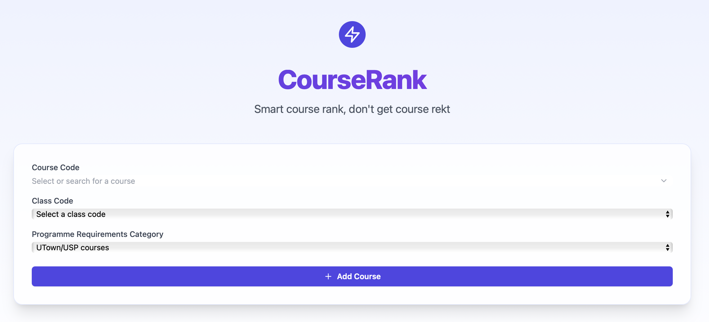
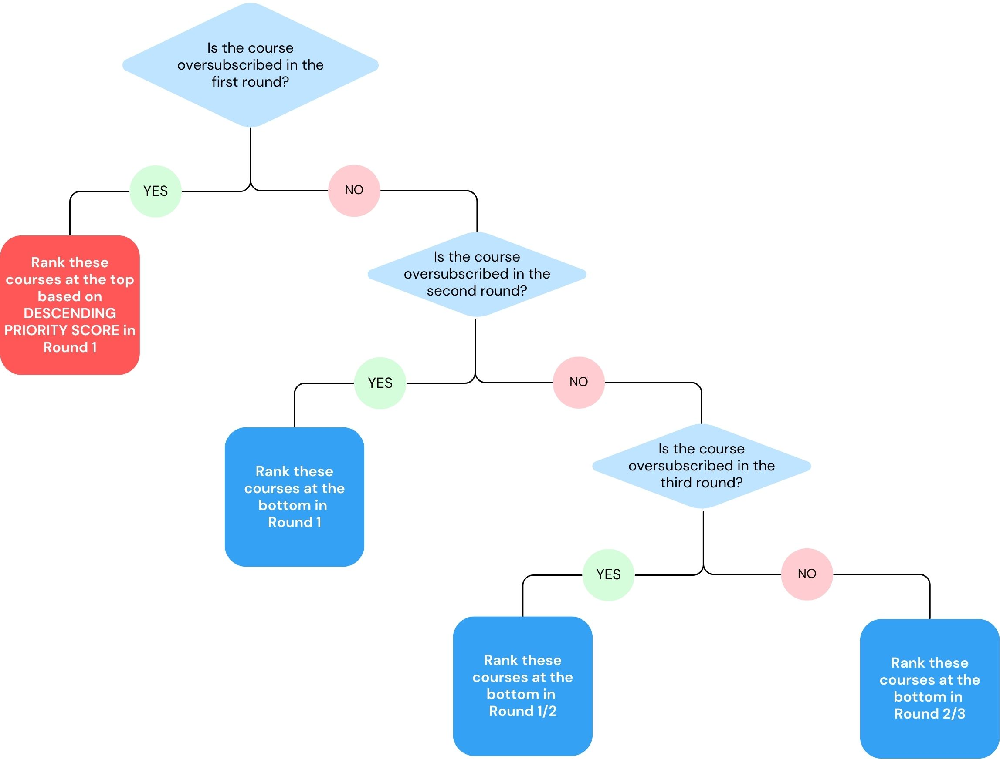
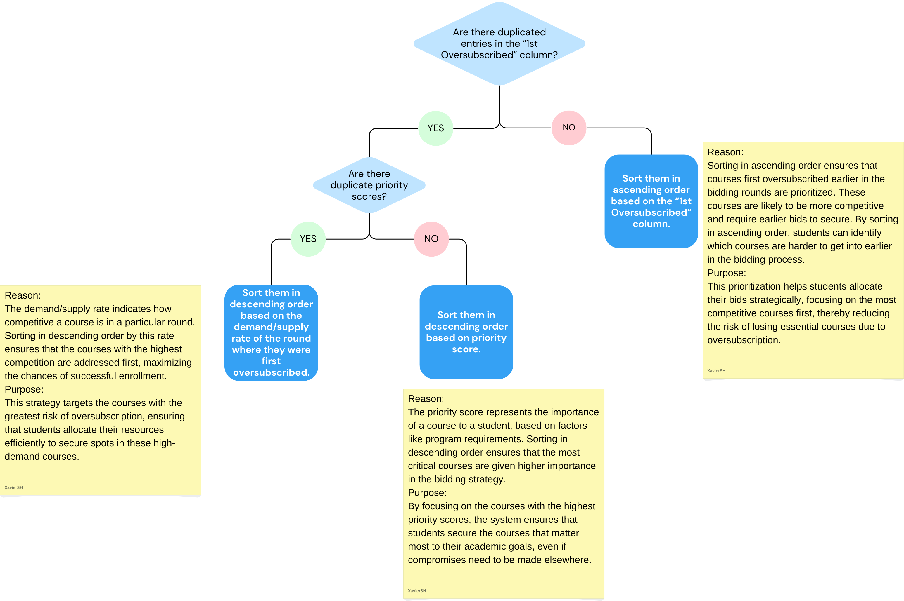

# CourseRank

## Inspiration
EVERY NUS student has to undergo multiple rounds of course bidding to get their desired courses. Being unable to secure the desired courses only adds to the stress of the students, and students are not able to study the courses they desire. 

However, not many students are aware of how the courses are allocated and only refer to the vacancy vs subscription rate, which does not accurately reflect the allocation. Our project thus aims to resolve this by assisting students in ranking the order of the courses to bid in various rounds, using an algorithm.

## What it does
Our project leverages the past semester’s demand and allocation report of the courses, as the corresponding semester’s demand trend is pretty similar (for AY24/25 Sem 2, we refer to AY23/24 Sem 2), due to the recommended schedule and pre-requisite order that students have to clear the courses.

We first find out for each course, in which round it has been first oversubscribed. As different courses have different subscription rates, we would recommend the students to bid before the round that has been first oversubscribed. This is critical, since there are instances where a course is undersubscribed even after all the rounds. We can choose to bid for that course in later rounds at a lower rank, thereby saving the higher ranks for courses that are usually oversubscribed.

With additional restrictions on the category of courses to bid in each round and the maximum number of courses differing in each round, we have also implemented this logic when coming up with the recommendation. 

## How we built it
We built the project using Python, developed the web application using ReactJS, and hosted using Netlify.

Our project uses the demand and allocation report of past semesters that is available on the NUS website as a PDF. We then wrote a Python script that only utilizes an API and pandas so that we are able to read all the pages in the pdf and transform the information to a readable data frame by converting the course codes, demand and vacancy into a CSV file. 

The logic that we used is that among the courses that the student wishes to take, we check which of the courses are undersubscribed and oversubscribed, taking note of the round that it has first happened. For the courses that have been oversubscribed in the same round, we would rank them based on their priority score.

Below is how our logic flows:

## Challenges we ran into
Currently, our approach is to prioritise the core modules, which is a safer option for students. In the case that the student wants to prioritise their second major and minor courses, our algorithm is unable to serve that yet. 

Furthermore, the performance of our project cannot be tested. But having said that, we have back-tested it using our own experiences in bidding for the courses in the previous semesters.

## Accomplishments that we're proud of
Based on past data, we built a scoring system that optimizes the ranking of selected courses in the best possible way to help students secure all the courses they require. Our project is relevant to all NUS students, and we are working for the better good.
We also provide users with a clear guide on which courses to bid for in each round, making it more convenient and much easier for less tech-savvy users to navigate and use our app.

## What we learned
Through this project, we now have a much better understanding of how the courses are allocated. As it also deals with the human mind, we have also realized the great importance of how human psychology comes into play when balancing between risk and reward.

## What's next for CourseRank
In order to make a better recommendation, it would be best to have data regarding the past data of the rough demographics of the students taking each course. By doing so, we are able to use the seniority points to also derive the rank and measure the chances a student will be allocated the course.
